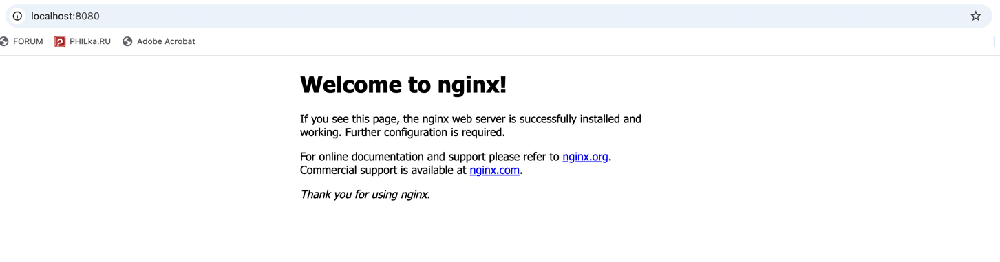

# DevOps Лаба 1: настраиваем Nginx с HTTPS, редиректами и виртуальными хостами

## Задача

Нужно настроить Nginx так, чтобы он:

1. Работал по HTTPS (пусть даже с самоподписанным сертификатом);
2. Перенаправлял всех любителей HTTP на HTTPS;
3. Умел обслуживать сразу несколько сайтов;
4. Использовал `alias`, чтобы сократить длинные пути к файлам.

---

## Подготовка: ставим Nginx

Начинаю, как всегда, с классики:

```bash
sudo apt-get update
sudo apt install nginx -y
````

После установки можно сразу проверить, работает ли сервер:
ввожу в браузере IP и вижу заветную страницу **"Welcome to Nginx"** — значит, всё живо.


---

## Делаем два проекта

Я решил, что у меня будет два сайта:

* **alpha.local**
* **beta.local**

Создаю папки и добавляю туда минимальные HTML-файлы:

```bash
sudo mkdir -p /var/www/alpha.local/html
sudo mkdir -p /var/www/beta.local/html

echo "<h1>Welcome to Alpha</h1>" | sudo tee /var/www/alpha.local/html/index.html
echo "<h1>Welcome to Beta</h1>" | sudo tee /var/www/beta.local/html/index.html
```

Права поправлю, чтобы Nginx не ворчал:

```bash
sudo chown -R $USER:$USER /var/www
sudo chmod -R 755 /var/www
```

---

## Конфиги для виртуальных хостов

Теперь нужно объяснить Nginx'у, что у нас не один сайт, а два.

Создаю файлы в `/etc/nginx/sites-available/`:

**`alpha.local`**

```nginx
server {
    listen 80;
    server_name alpha.local;
    root /var/www/alpha.local/html;
    index index.html;

    location / {
        try_files $uri $uri/ =404;
    }
}
```

**`beta.local`**

```nginx
server {
    listen 80;
    server_name beta.local;
    root /var/www/beta.local/html;
    index index.html;

    location / {
        try_files $uri $uri/ =404;
    }
}
```

Активирую конфиги:

```bash
sudo ln -s /etc/nginx/sites-available/alpha.local /etc/nginx/sites-enabled/
sudo ln -s /etc/nginx/sites-available/beta.local /etc/nginx/sites-enabled/
sudo nginx -t
sudo systemctl reload nginx
```

Теперь добавляю их в `/etc/hosts` на локальной машине:

```
127.0.0.1 alpha.local
127.0.0.1 beta.local
```

Проверяю в браузере — и оба сайта уже открываются (пока по http).

---

## Включаем HTTPS

Настоящий сертификат я брать не будем — это отдельная история с доменами и валидацией.
Сделаю самоподписанные сертификаты, чтобы просто увидеть HTTPS в действии:

```bash
sudo mkdir -p /etc/nginx/ssl

sudo openssl req -x509 -nodes -days 365 -newkey rsa:2048 \
  -keyout /etc/nginx/ssl/alpha.local.key \
  -out /etc/nginx/ssl/alpha.local.crt

sudo openssl req -x509 -nodes -days 365 -newkey rsa:2048 \
  -keyout /etc/nginx/ssl/beta.local.key \
  -out /etc/nginx/ssl/beta.local.crt
```

---

## Настраиваем редирект с HTTP на HTTPS

Редактирую конфиги, добавляю второй `server` блок — теперь с SSL:

**`alpha.local`**

```nginx
server {
    listen 80;
    server_name alpha.local;
    return 301 https://$host$request_uri;
}

server {
    listen 443 ssl;
    server_name alpha.local;

    ssl_certificate     /etc/nginx/ssl/alpha.local.crt;
    ssl_certificate_key /etc/nginx/ssl/alpha.local.key;

    root /var/www/alpha.local/html;
    index index.html;

    location / {
        try_files $uri $uri/ =404;
    }
}
```

**`beta.local`** аналогично, только с другими именами сертификатов.

Проверяю конфиги:

```bash
sudo nginx -t
sudo systemctl reload nginx
```

Теперь при заходе на `http://alpha.local:8081` меня сразу кидает на `https://alpha.local:8443`.


Если на на `http://beta.local:8082` меня сразу кидает на `https://beta.local:8444`.


---

## Добавляем alias

Хочется сделать так, чтобы длинные пути выглядели попроще.
Например, у меня есть `/var/www/alpha.local/html/files/documents/longfile.html`,
а обращаться к нему я хочу как `/docs/longfile.html`.

Создаю нужные файлы:

```bash
mkdir -p /var/www/alpha.local/html/files/documents
echo "Hidden deep file" | sudo tee /var/www/alpha.local/html/files/documents/longfile.html
```

Теперь в конфиг `alpha.local` добавляю:

```nginx
location /docs/ {
    alias /var/www/alpha.local/html/files/documents/;
}
```

Перезагружаю Nginx и открываю `https://alpha.local/docs/longfile.html` — работает!:)


---

## Результат

В итоге:

* Два сайта (`alpha.local`, `beta.local`) на одном сервере;
* Всё работает по **HTTPS**;
* **HTTP → HTTPS** редирект настроен;
* Есть **alias**, чтобы не писать длинные пути.

И всё это на чистом **Nginx**, без магии и лишней боли.
Теперь можно добавить CI/CD или Docker и будет мини-продакшн!

---

## Заключение

В процессе я освежил в памяти базовые штуки вроде SSL, виртуальных хостов и alias’ов.
Понял, что Nginx - гибкий инструментом,
который легко подружить даже с самыми простыми проектами.

И да, браузер ругается на «ненадёжный сертификат» — но это же самоподписанный:)

А ну и на маке тоже попробавал, даже проще оказалось, скрипт приложил(он только для brew, поэтому перед запуском надо прописать - brew install nginx)

