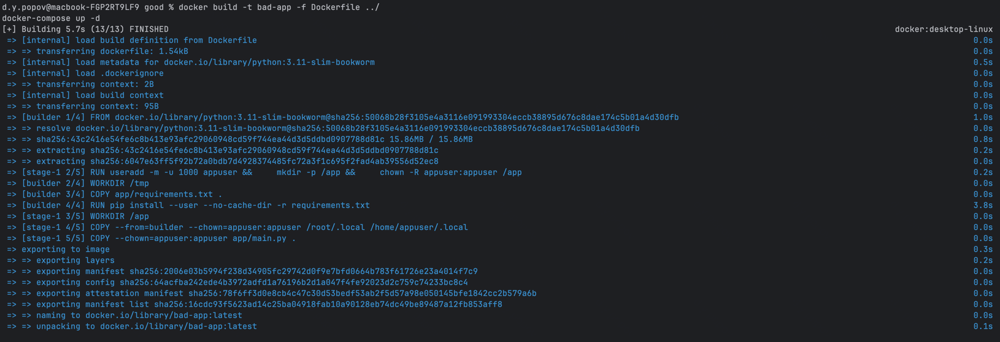
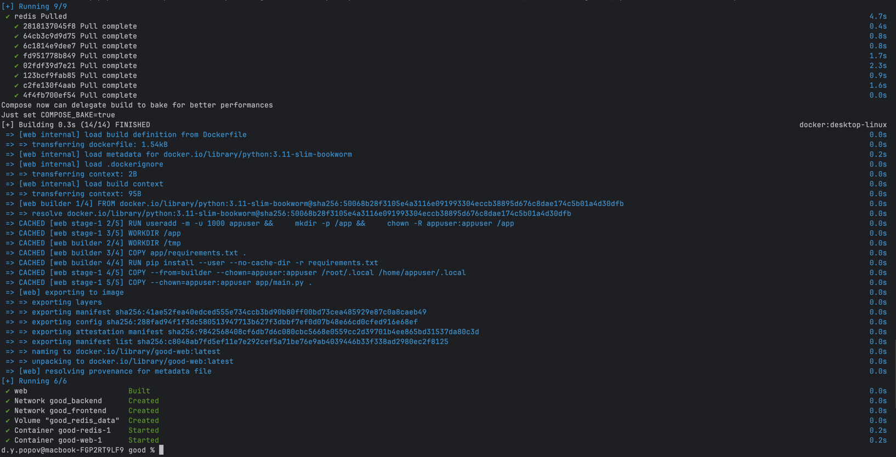
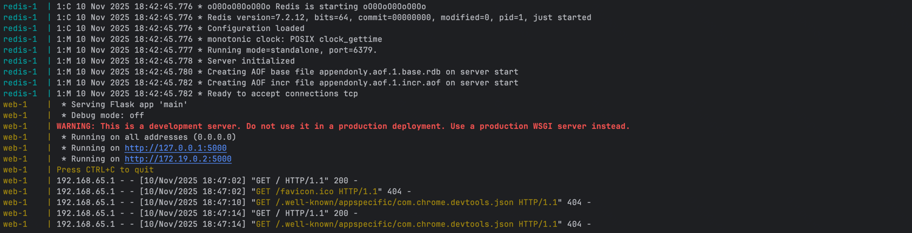
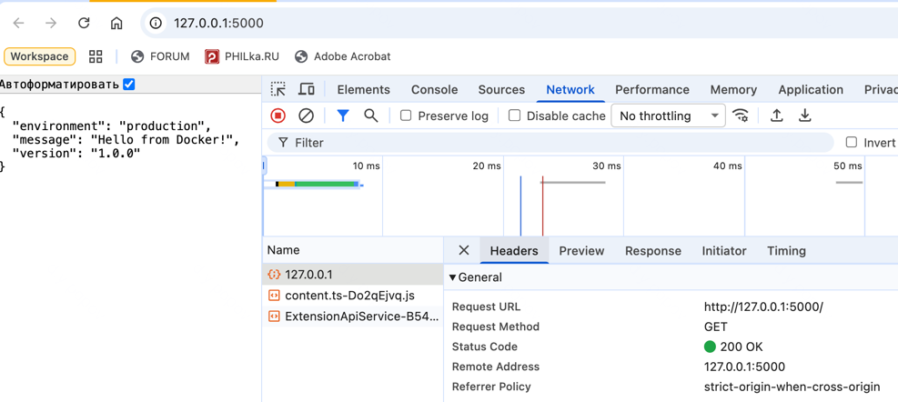

# DevOps Лаба 2: от плохих практик к хорошим

## Обычная часть: Dockerfile

Создал два Dockerfile — плохой и хороший. В плохом намеренно завёл как минимум три антипаттерна, а в хорошем их исправил.

## Плохие практики в плохом Dockerfile

### 1. **Использование `latest` тега образа**

**Почему плохо:**  
Кто знает, что там в `latest`? Сегодня это Python 3.11, завтра — 3.12, а через месяц выходит 4.0, и всё ломается. Это как обед в неизвестном ресторане — может быть вкусно, а может и нет.

**Как исправил:**  
Задал явную версию: `FROM python:3.11-bookworm`. Теперь поведение образа стабильно.

---

### 2. **Копирование `requirements.txt` как части контейнера**

**Почему плохо:**  
Зачем тащить `requirements.txt` внутрь образа, если он нужен только для установки зависимостей? Это как брать с собой коробку от пиццы, когда уже съел пиццу.

**Как исправил:**  
Использовал `--mount=type=bind` для временного доступа к `requirements.txt`. Теперь он не остаётся в контейнере.

---

### 3. **Копирование лишних файлов**

**Почему плохо:**  
Копируем всю папку `model_api`, даже если в ней есть лишнее — `.git`, `.md`, логи и т.д. Это как заливать в чемодан всё подряд, вместо того чтобы выбрать только нужное.

**Как исправил:**  
Создал `.dockerignore` файл и добавил туда всё ненужное. Теперь в контейнере только то, что действительно нужно.

---

## Плохие практики при работе с контейнерами

### 1. **Запуск контейнера от имени root**

**Почему плохо:**  
Если кто-то получит доступ к контейнеру, он получает доступ ко всей хост-системе. Это как давать ключи от квартиры первому встречному на улице.

**Как избежать:**  
Создать отдельного пользователя в Dockerfile и переключиться на него с помощью `USER`.

---

### 2. **Использование `docker exec` в автоматизации**

**Почему плохо:**  
Контейнеры должны быть самодостаточными. Если для запуска приложения нужно лезть внутрь и запускать команду через `exec`, это нарушает принцип идемпотентности и автоматизации.

**Как избежать:**  
Всё должно стартовать через `CMD` или `ENTRYPOINT`. Никаких "дополнительных действий".

---

## Сложная часть: Docker Compose

Также создал два compose-файла — плохой и хороший. В плохом завёл как минимум три антипаттерна, а в хорошем их исправил

## Плохие практики в плохом docker-compose.yml

### 1. **Хардкод переменных окружения**

**Почему плохо:**  
Конфиденциальные данные лежат прямо в файле. Если файл попадёт в репозиторий — всё, секрет не секрет.

**Как исправил:**  
Перенёс переменные в `.env` и секреты в отдельные файлы. Теперь `docker-compose` подхватывает их извне.

---

### 2. **Неуправляемые секреты**

**Почему плохо:**  
Если секреты жёстко закодированы, их сложно обновлять и контролировать доступ. Это как пароль в коде — плохая идея.

**Как исправил:**  
Использовал `secrets` и отдельный файл `secrets/secret_key.txt`. Теперь секреты можно обновлять без пересборки контейнера.

---

### 3. **Отсутствие интерполяции переменных**

**Почему плохо:**  
Если переменные окружения часто меняются (например, для dev/prod), то ручное редактирование docker-compose становится утомительным.

**Как исправил:**  
Использовал `${VAR}` в `docker-compose.yml`. Теперь можно менять поведение проекта, просто подставляя другой `.env`.

---

## Сетевая изоляция контейнеров

> А теперь немного магии: как сделать так, чтобы контейнеры поднялись вместе, но не "видели" друг друга?

**Как добился:**  
Поместил контейнеры в разные пользовательские сети и **не указывал `links`** или `depends_on` напрямую.

Пример:

```yaml
networks:
  frontend:
    driver: bridge
  backend:
    driver: bridge

services:
  web:
    networks:
      - frontend

  db:
    networks:
      - backend
```

**Что получилось:**  
Контейнеры `web` и `db` поднимаются вместе, но не могут взаимодействовать по сети напрямую. Каждый видит только свою сеть. Это как разные VLAN'ы в сетях — изоляция на уровне драйвера.

---

## Результаты

Всё работает, контейнеры изолированы, Docker не ворчит:



*Запуск Docker Compose*


*Всё поднялось, и даже контейнеры не "видят" друг друга*

 
*Фронт и API отвечают — жизнь удалась*

---

## Выводы

> "Контейнеры — это как дом. В нём можно жить комфортно, а можно — вечно чинить что-то".

- Используем конкретные версии образов, чтобы не сломалось завтра
- Не храним секреты в коде и Dockerfile
- Убираем лишнее из образа — меньше поверхность атак
- Работаем с контейнерами как с "черными ящиками", без ручного вмешательства
- Научились изолировать контейнеры в разных сетях, даже если они в одном compose-файле
